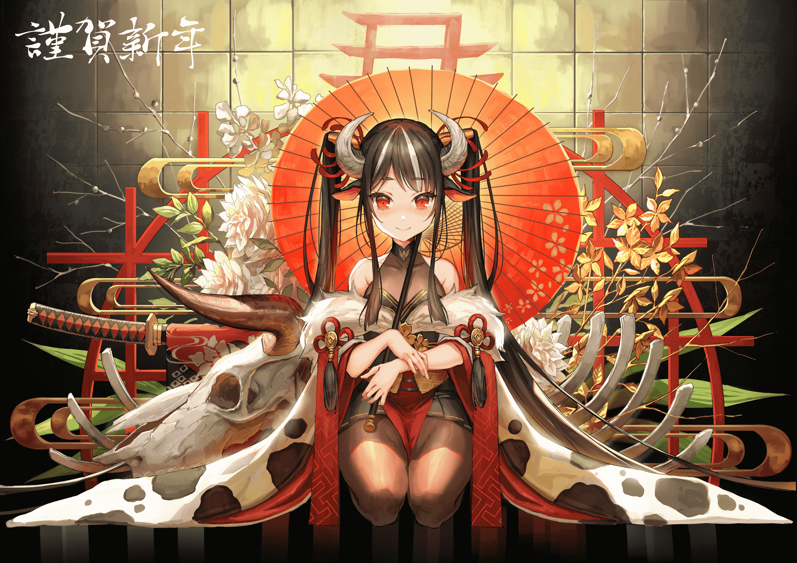

# 2021年

## 01月


### 编辑记录
```json
{
    "1615610336": "占位。",
    "1615610336": "将“编辑记录”部分改为 JSON 样式。尝试修正“获取方式”部分“获取-磁力链接”不显示的问题，但似乎是 Github 的问题。",
    "1615609914": "编辑新排版。(10/27)",
    "1614665566": "溯源增加更多分类。看直播去了。(27/64)",
    "1614425054": "恰晚饭。(20/64)",
    "1614312615": "吃点东西，看点番。(11/64)",
    "1614184765": "完成溯源模板编辑。溯源进度 02/64。"
}
```

### 获取方式
- [文章-琉璃神社](https://www.liuli.cat/wp/81376.html)
- [获取-磁力链接](magnet:?xt=urn:btih:2825e7d89d843e21a25f65c238116c28719556da)

### 警告！
本图集部分图片包含裸露或敏感内容，请满足当地[法定成年](https://zh.wikipedia.org/wiki/成人年龄)后尝试获取相关内容。

《[中华人民共和国民法典](http://www.npc.gov.cn/npc/c30834/202006/75ba6483b8344591abd07917e1d25cc8.shtml)》(节选)
> **第十七条**　十八周岁以上的自然人为成年人。不满十八周岁的自然人为未成年人。
> **第十八条**　成年人为完全民事行为能力人，可以独立实施民事法律行为。
> 十六周岁以上的未成年人，以自己的劳动收入为主要生活来源的，视为完全民事行为能力人。

### 溯源
文件名 | 绘图名(译名, 绘图链接) | 绘师昵称(作者链接) | 许可 | 备注 | 溯源工具 
| - | - | - | -
acg.gy_01.jpg | [drawing(绘图中)](https://www.pixiv.net/artworks/86523809) | [somna](https://www.pixiv.net/users/16365055) | 禁止商用、转载申明出处。[微博](https://weibo.com/u/5173702596) | - | sauceNAO
acg.gy_02.jpg | [番外#另外一个世界](https://www.pixiv.net/artworks/86642542) | ~~[账号已消失](https://www.pixiv.net/users/16468954)~~ | - | 绘图中包含《碧蓝航线》游戏及衍射作品角色，指挥官和雪风([碧蓝航线WIKI-B站镜像](https://wiki.biligame.com/blhx/雪风))。 | sauceNAO
acg.gy_03.jpg | [「よく来たわね～」(「这我常来~」)](https://www.pixiv.net/artworks/86665714) | [Me/R](https://www.pixiv.net/users/33830894) | [电子邮箱](MeR.illust@gmail.com) | 绘图中包含《明日方舟》游戏及衍射作品角色，W([明日方舟WIKI-B站镜像](https://wiki.biligame.com/arknights/W))。 | sauceNAO
acg.gy_04.jpg
acg.gy_05.png
acg.gy_06.jpg
acg.gy_07.png
acg.gy_08.jpg
acg.gy_09.jpg
acg.gy_10.jpg
acg.gy_11.png
acg.gy_12.png
acg.gy_13.png
acg.gy_14.png
acg.gy_15.png
acg.gy_16.png
acg.gy_17.jpg
acg.gy_18.jpg
acg.gy_19.jpg
acg.gy_20.jpg
acg.gy_21.jpg
acg.gy_22.jpg
acg.gy_23.jpg
acg.gy_24.png
acg.gy_25.jpg
acg.gy_26.jpg
acg.gy_27.jpg
acg.gy_28.jpg
acg.gy_29.png
acg.gy_30.jpg
acg.gy_31.jpg
acg.gy_32.jpg
acg.gy_33.jpg
acg.gy_34.png
acg.gy_35.png
acg.gy_36.png
acg.gy_37.png
acg.gy_38.png
acg.gy_39.png
acg.gy_40.jpg
acg.gy_41.jpg
acg.gy_42.jpg
acg.gy_43.jpg
acg.gy_44.jpg
acg.gy_45.png
acg.gy_46.jpg
acg.gy_47.jpg
acg.gy_48.jpg
acg.gy_49.png
acg.gy_50.jpg
acg.gy_51.jpg
acg.gy_52.jpg
acg.gy_53.png
acg.gy_54.jpg
acg.gy_55.jpg
acg.gy_56.jpg
acg.gy_57.jpg
acg.gy_58.jpg
acg.gy_59.jpg
acg.gy_60.jpg
acg.gy_61.jpg
acg.gy_62.jpg
acg.gy_63.jpg
acg.gy_64.jpg


文件名 | 作品名 | 作者 | 许可 | 画师联系方式 | 备注 | 溯源
| - | - | - | - | - | - | -
acg.gy_01.jpg | <span title="绘图">drawing</span> | [somna](https://www.pixiv.net/users/16365055) | 未注明。 | [微博](https://weibo.com/u/5173702596) | - | https://saucenao.com > https://www.pixiv.net/artworks/86523809
acg.gy_02.jpg | 番外#另外一个世界 | [Dalian](https://www.pixiv.net/users/16468954) | - | - | 原账号和绘图已不存在。绘图中包含《碧蓝航线》游戏及衍生作品角色，指挥官和雪风([萌百](https://zh.moegirl.org.cn/碧蓝航线:雪风) [哔哩维基](https://wiki.biligame.com/blhx/雪风))。 | https://saucenao.com > https://www.pixiv.net/artworks/86642542
acg.gy_03.jpg | <span title="「很高兴你来了~」">「よく来たわね～」</span> | [Me/R](https://www.pixiv.net/users/33830894) | - | [电邮](mailto:MeR.illust@gmail.com) | 绘图中包含《明日方舟》游戏及衍生作品角色，W([哔哩维基](https://wiki.biligame.com/arknights/W) [萌百](https://zh.moegirl.org.cn/明日方舟:W))。 | https://saucenao.com > https://www.pixiv.net/artworks/86665714
acg.gy_04.jpg | <span title="「爱是什么？」">「What is Love?」</span> | [BSue/ビシュ](https://www.pixiv.net/users/9975772) | - | [电邮](mailto:lucas200755@gmail.com) | 绘图中包含《偶像大师 灰姑娘女孩》游戏及衍生作品角色，[梦见璃亚梦](https://zh.moegirl.org.cn/梦见璃亚梦)。 | https://saucenao.com > https://www.pixiv.net/artworks/86695147
acg.gy_05.png | <span title="新年快乐2021">賀正2021</span> | [Atha（アサ）](https://www.pixiv.net/users/3367474) | - | [推特](https://twitter.com/Atha_re)、[电邮](mailto:requiem3lee◆gmail.com) | - | https://saucenao.com > https://www.pixiv.net/artworks/86696502
acg.gy_06.jpg | ❉ | [Matcha_](https://www.pixiv.net/users/2583663) | - | [推特](https://twitter.com/matchach)、[微博](https://m.weibo.cn/u/1990983307)、[电邮](mailto:lmatchachmat@gmail.com) | 绘图中包含[初音未来](https://zh.moegirl.org.cn/初音未来)二次创作角色[雪未来](https://zh.moegirl.org.cn/雪未来)。 | https://saucenao.com > https://www.pixiv.net/artworks/86708470
acg.gy_07.png | <span title="新年快乐！！🐃">Happy New Year!!🐃</span> | [おゆゆ](https://www.pixiv.net/users/41464792) | - | [电邮](mailto:loyuyuyuyu02@gmail.com) | - | https://saucenao.com > https://www.pixiv.net/artworks/86722229
acg.gy_08.jpg | 新年好 | [山桂贰](https://www.pixiv.net/users/7638711) | 禁止二创(衍生内容应该不算二创吧)，转载需申明出处。 | [电邮](mailto:l2680647672@qq.com) | 绘图中包含《碧蓝航线》游戏及衍生作品角色，[光辉](https://zh.moegirl.org.cn/碧蓝航线:光辉)和[独角兽](https://zh.moegirl.org.cn/碧蓝航线:独角兽)。 | https://saucenao.com > https://www.pixiv.net/artworks/86735754
acg.gy_09.jpg | <span title="灵梦♥">れいむ♥</span> | [カノ](https://www.pixiv.net/users/19600013) | - | [推特](https://twitter.com/Kerno_kr)、[电邮](mailto:lmgnnew12@gmail.com) | 绘图中包含《东方Project》游戏及衍生作品角色，[博丽灵梦](https://zh.moegirl.org.cn/博丽灵梦)。 | https://saucenao.com > https://www.pixiv.net/artworks/84479659
acg.gy_10.jpg | 元旦 | [REKAERB_MAERD](https://www.pixiv.net/users/11578499) | 禁止商用，转载需申明出处。 | - | 绘图中可能包含未正式发布游戏《终末阵线：伊诺贝塔》及衍生作品角色。 | https://saucenao.com > https://www.pixiv.net/artworks/86770249
acg.gy_11.png | <span title=""></span> | []() | - | - | - | https://saucenao.com > 
acg.gy_12.png | <span title=""></span> | []() | - | - | - | https://saucenao.com > 
acg.gy_13.png | <span title=""></span> | []() | - | - | - | https://saucenao.com > 
acg.gy_14.png | <span title=""></span> | []() | - | - | - | https://saucenao.com > 
acg.gy_15.png | <span title=""></span> | []() | - | - | - | https://saucenao.com > 
acg.gy_16.png | <span title=""></span> | []() | - | - | - | https://saucenao.com > 
acg.gy_17.jpg | <span title=""></span> | []() | - | - | - | https://saucenao.com > 
acg.gy_18.jpg | <span title=""></span> | []() | - | - | - | https://saucenao.com > 
acg.gy_19.jpg | <span title=""></span> | []() | - | - | - | https://saucenao.com > 
acg.gy_20.jpg | <span title=""></span> | []() | - | - | - | https://saucenao.com > 
acg.gy_21.jpg | <span title=""></span> | []() | - | - | - | https://saucenao.com > 
acg.gy_22.jpg | <span title=""></span> | []() | - | - | - | https://saucenao.com > 
acg.gy_23.jpg | <span title=""></span> | []() | - | - | - | https://saucenao.com > 
acg.gy_24.png | <span title=""></span> | []() | - | - | - | https://saucenao.com > 
acg.gy_25.jpg | <span title=""></span> | []() | - | - | - | https://saucenao.com > 
acg.gy_26.jpg | <span title=""></span> | []() | - | - | - | https://saucenao.com > 
acg.gy_27.jpg | <span title=""></span> | []() | - | - | - | https://saucenao.com > 
acg.gy_28.jpg | <span title=""></span> | []() | - | - | - | https://saucenao.com > 
acg.gy_29.png | <span title=""></span> | []() | - | - | - | https://saucenao.com > 
acg.gy_30.jpg | <span title=""></span> | []() | - | - | - | https://saucenao.com > 
acg.gy_31.jpg | <span title=""></span> | []() | - | - | - | https://saucenao.com > 
acg.gy_32.jpg | <span title=""></span> | []() | - | - | - | https://saucenao.com > 
acg.gy_33.jpg | <span title=""></span> | []() | - | - | - | https://saucenao.com > 
acg.gy_34.png | <span title=""></span> | []() | - | - | - | https://saucenao.com > 
acg.gy_35.png | <span title=""></span> | []() | - | - | - | https://saucenao.com > 
acg.gy_36.png | <span title=""></span> | []() | - | - | - | https://saucenao.com > 
acg.gy_37.png | <span title=""></span> | []() | - | - | - | https://saucenao.com > 
acg.gy_38.png | <span title=""></span> | []() | - | - | - | https://saucenao.com > 
acg.gy_39.png | <span title=""></span> | []() | - | - | - | https://saucenao.com > 
acg.gy_40.jpg | <span title=""></span> | []() | - | - | - | https://saucenao.com > 
acg.gy_41.jpg | <span title=""></span> | []() | - | - | - | https://saucenao.com > 
acg.gy_42.jpg | <span title=""></span> | []() | - | - | - | https://saucenao.com > 
acg.gy_43.jpg | <span title=""></span> | []() | - | - | - | https://saucenao.com > 
acg.gy_44.jpg | <span title=""></span> | []() | - | - | - | https://saucenao.com > 
acg.gy_45.png | <span title=""></span> | []() | - | - | - | https://saucenao.com > 
acg.gy_46.jpg | <span title=""></span> | []() | - | - | - | https://saucenao.com > 
acg.gy_47.jpg | <span title=""></span> | []() | - | - | - | https://saucenao.com > 
acg.gy_48.jpg | <span title=""></span> | []() | - | - | - | https://saucenao.com > 
acg.gy_49.png | <span title=""></span> | []() | - | - | - | https://saucenao.com > 
acg.gy_50.jpg | <span title=""></span> | []() | - | - | - | https://saucenao.com > 
acg.gy_51.jpg | <span title=""></span> | []() | - | - | - | https://saucenao.com > 
acg.gy_52.jpg | <span title=""></span> | []() | - | - | - | https://saucenao.com > 
acg.gy_53.png | <span title=""></span> | []() | - | - | - | https://saucenao.com > 
acg.gy_54.jpg | <span title=""></span> | []() | - | - | - | https://saucenao.com > 
acg.gy_55.jpg | <span title=""></span> | []() | - | - | - | https://saucenao.com > 
acg.gy_56.jpg | <span title=""></span> | []() | - | - | - | https://saucenao.com > 
acg.gy_57.jpg | <span title=""></span> | []() | - | - | - | https://saucenao.com > 
acg.gy_58.jpg | <span title=""></span> | []() | - | - | - | https://saucenao.com > 
acg.gy_59.jpg | <span title=""></span> | []() | - | - | - | https://saucenao.com > 
acg.gy_60.jpg | <span title=""></span> | []() | - | - | - | https://saucenao.com > 
acg.gy_61.jpg | <span title=""></span> | []() | - | - | - | https://saucenao.com > 
acg.gy_62.jpg | <span title=""></span> | []() | - | - | - | https://saucenao.com > 
acg.gy_63.jpg | <span title=""></span> | []() | - | - | - | https://saucenao.com > 
acg.gy_64.jpg | <span title=""></span> | []() | - | - | - | https://saucenao.com > 

文件名 | 作品名 | 作者 | 备注 | 溯源
| - | - | - | - | -
acg.gy_11.png | 【工作图】LEGION拯救姬 | [純白可憐](https://www.pixiv.net/users/20778107) | [画师微博](https://m.weibo.cn/u/5711128716)。商业绘图，使用时注意版权。 | https://saucenao.com > https://www.pixiv.net/artworks/86849083
acg.gy_12.png | 同上 | ~ | ~ | ~
acg.gy_13.png | ~ | ~ | ~ | ~
acg.gy_14.png | ~ | ~ | ~ | ~
acg.gy_15.png | ~ | ~ | ~ | ~
acg.gy_16.png | ~ | ~ | ~ | ~
acg.gy_17.jpg | <span title="新年快乐">HappyNewYear</span> | [大熊まい◆お仕事募集](https://www.pixiv.net/users/29449) | 禁止商用，转载需申明出处。详情请前往作者页面，点击“查看个人资料”后查阅“私のイラストの使用について”部分。 | https://saucenao.com > https://www.pixiv.net/artworks/86849065
acg.gy_18.jpg | <span title="窗边">窓辺</span> | [Ume梅](https://www.pixiv.net/users/131232) | - | https://saucenao.com > https://www.pixiv.net/artworks/86865203
acg.gy_19.jpg | <span title="毛瑟 Kar98k 步枪(少女前线)">Kar98k(ドールズフロントライン)</span> | [魂遊](https://www.pixiv.net/users/757828) | - | https://saucenao.com > https://www.pixiv.net/artworks/80810835
acg.gy_20.jpg | 幻书启世录-康熙字典 | [orry](https://www.pixiv.net/users/2147813) | [画师微博](https://m.weibo.cn/u/1242036277)。绘图中可能包含《幻书启世录》游戏及衍生作品角色，蓦然(《人间词话》)。 | https://saucenao.com > https://www.pixiv.net/artworks/86903954
acg.gy_21.jpg | <span title="王座">Throne</span> | [wlop](https://www.pixiv.net/users/2188232) | [画师微博](https://m.weibo.cn/u/1804342520)。绘图中可能包含《鬼刀》漫画及衍生作品角色，[Aeolian(风玲)](https://www.bilibili.com/video/BV1fp4y1S7U9)和lylian。 | https://saucenao.com > https://www.pixiv.net/users/2188232
acg.gy_22.jpg | <span title="钢琴 2">piano 2</span> | [wlop](https://www.deviantart.com/wlop) | 绘图中可能包含《鬼刀》漫画及衍生作品角色，[海琴烟](https://www.bilibili.com/video/BV1xp4y1a7he)。 | https://saucenao.com > https://www.deviantart.com/wlop/art/piano-2-855580290
acg.gy_23.jpg | ~ | ~ | ~ | ~
acg.gy_24.png | <span title="《害羞的她3》">《はにかみ彼女3》</span> | [ピロ水](https://twitter.com/piromizu) | 绘图中包含《はにかみ彼女3》漫画及衍生作品角色，minazumi kasane(笠根美澄)、myouga satsuki(鸣贺聪月)和shizuki neru(水木直路)。中文译名仅使用机器翻译，可能不正确。 | https://saucenao.com > https://e-hentai.org/g/1823923/16fb3eea58 > https://www.melonbooks.co.jp/detail/detail.php?product_id=776995
acg.gy_25.jpg | <span title="阅读">Reading</span> | [wlop](https://www.pixiv.net/users/2188232) | 绘图中包含《鬼刀》漫画及衍生作品角色，[Aeolian(风玲)](https://www.bilibili.com/video/BV1fp4y1S7U9)。 | https://saucenao.com > https://www.pixiv.net/artworks/83222944
acg.gy_26.jpg | SOP SOP | [SD BigPie](https://www.pixiv.net/users/2994762) | 绘图中包含《少女前线》游戏及衍生作品角色，M4 SOPMODII([萌百](ttps://zh.moegirl.org.cn/少女前线:M4_SOPMOD_II) [少前百科](http://www.gfwiki.org/w/M4_SOPMODII)) | https://saucenao.com > https://www.pixiv.net/artworks/87029912
acg.gy_27.jpg | 泥岩 | [千夜QYS3](https://www.pixiv.net/users/7210261) | 禁止商用，转载需申明出处，详情请查看画师 pixiv 首页。[画师微博](https://m.weibo.cn/u/3635354593)。绘图中包含《明日方舟》游戏及衍生作品角色，[泥岩](https://zh.moegirl.org.cn/明日方舟:泥岩) | https://saucenao.com > https://www.pixiv.net/artworks/86993018